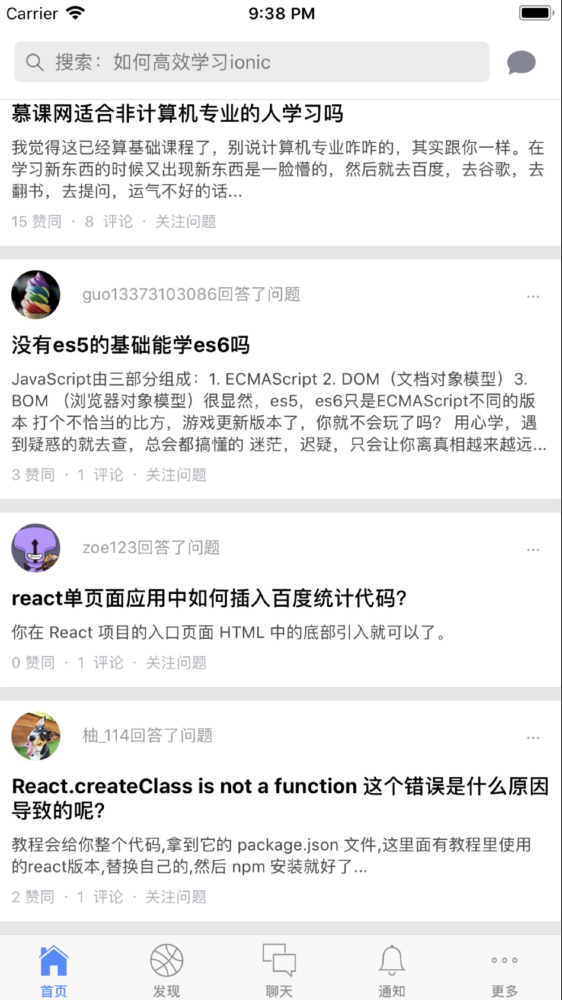

## 前言

<h3>这是根据线上视频教学学习的一套ionic3 开发教程学习的案例</h3>

## 目标

<p>从中学习到该如何去使用ionic进行开发</p>

## 技术栈

<p>ionic.3 + angular </p>

## 运行项目

``` bash
# install dependencies
npm install

# serve with hot reload at localhost:8100
ionic serve

# 调试 
ionic cordova platform add ios/android


# add platform
ionic cordova platform add ios/android

# build
ionic cordova build ios/android

```

## ios真机调试

<h3>
  <a href="https://blog.csdn.net/xiaozhi_2016/article/details/75103357
">ionic应用在mac上使用xcode7.0进行iphone真机调试</a>
  <a href="https://www.cnblogs.com/final-elysion/p/6091600.html">ionic ios项目真机运行-不用开发者账号</a>
  <a href="https://www.jianshu.com/p/011eb4b6f068">iOS ionic实时调试（含真机）</a>
</h3>

##  部分截图

<p>
  
  
</p>

